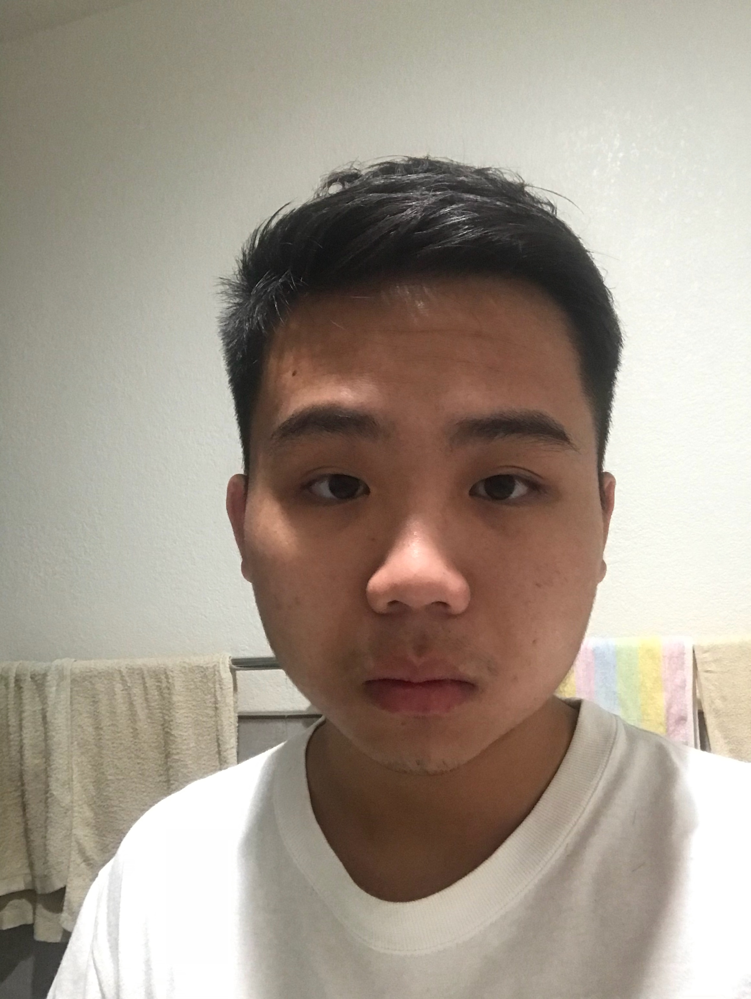

{width="40%"}

## About me
 Hello, My name is Xingxin Li, I'm from China and i am major in GIS at UCSB because of GIS is one of my favorite field to learn and UCSB has a many opportunity to study GIS and more works can study. Nice to meet you all!!!

## Experience

2015/08 - 2016/06

Library Assistant/John A.Rowland High School/Rowland Heights, CA 91748

  - Organize Book
  - Help students to search a book
  - Library copy

2016/06 - 2019/08

Busboy/Phoenix Food Boutique/Rowland Heights, CA 91748

  - Serving Food
  - Making Drink
  - Earn Paycheck
  
## Education

  Mt. San Antonio College
  
  - Associates Degree of Business
  
  - 2016/08 - 2019/06
  
  University of California, Santa Barbara
  
  - Bachelor of Arts, Geography GIS emphasize
  
  - 2019/09 - Present
  
## Language I spoked

  - Chinese
    - Mandarin (Proficiency)
    - Cantonese (Proficiency)
    - Taiwanese (Advanced)
    - Hakka (Intermediate)
    
    
  - English (Advanced)
  
  - Japanese (Intermediate)
  
  - Spanish (Elementary)

  
  
