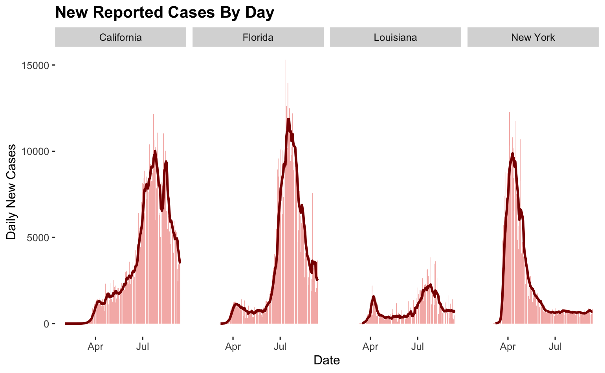
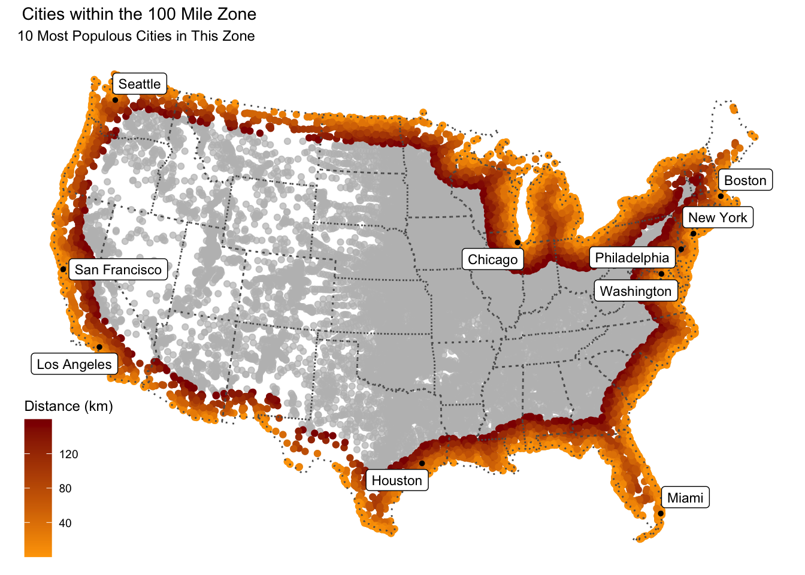
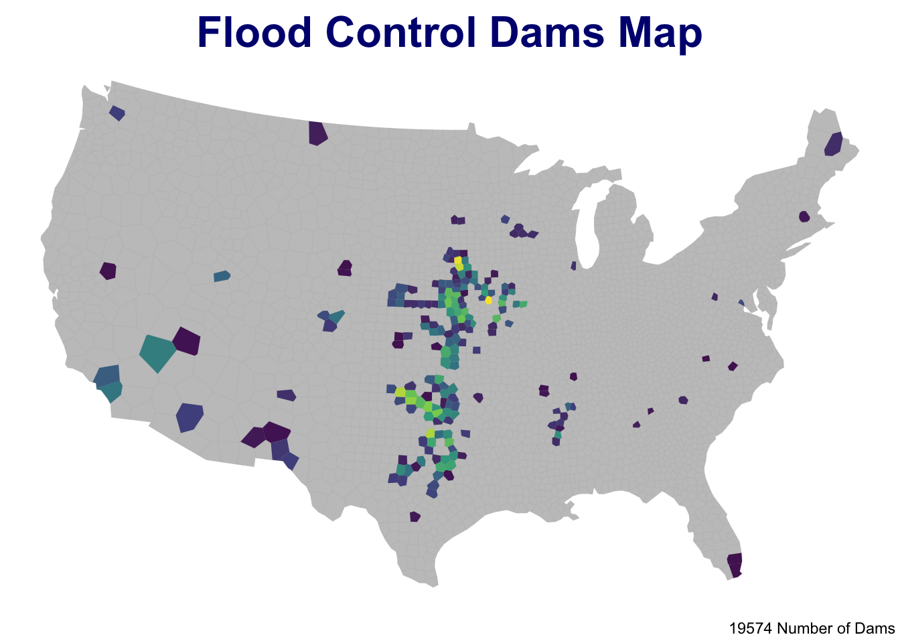
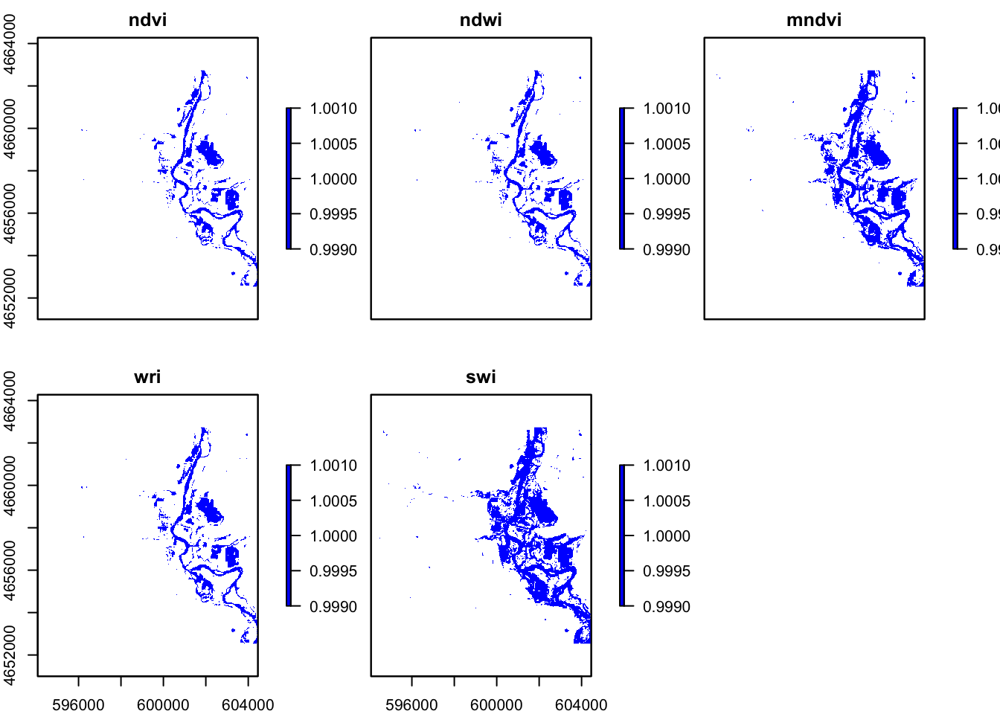
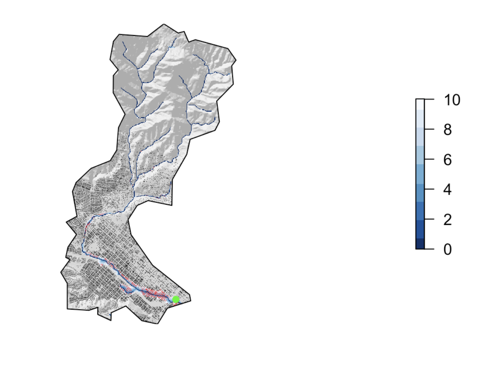

In this summer of 2020, I took a GEOG 176A class based in R. It is my first time using R to work on GIS, and I am so exciting to learn R and GIS. Here is all the work I would expect to learn! 

- We are doing all the R work with github

## [Lab 1: Data Science Workflows](https://ousdon.github.io/geog176a-lab1/index.html)

- Learned how to use rstudio and installation.
- Learned how we work all the R work with github. 
- Learned how to use R and github to built a website.
- Learned how to remote local data, rmd, html, and ymal publish the work.

## [Lab 2: Data Wrangling](https://ousdon.github.io/geog176a-lab1/lab2.html)

- Learned how to practice date wrangling and visualization skills.
- Interacted with real-time covid-19 data
- Study on using data.frame in project.

## [Lab 3: Projections, Distances, and Mapping](https://ousdon.github.io/geog176a-lab1/lab3.html)

- Use sf to create data frame on futher calculations and measurements.
- Define a projection and getting cities distance and boundries data .
- Gather all the distances calculation and use ggplot to create a map.
- Apply in real world application

## [Lab 4: Tesselations, Spatial Joins, and Point-in-Polygon](https://ousdon.github.io/geog176a-lab1/lab-04.html)

- Use tessellation to work with the dam data.
- Use point-in-polygon with tessellation plots and find out the best solution.
- Create visualization for dam data and analysis NID.

## [Lab 5: Raster Analysis](https://ousdon.github.io/geog176a-lab1/lab5.html)

- Use raster data to analyze a flood event near Palo, Iowa
- Learned how to use RGB to work on the graphing.
- calculate the kmeans to make it more accuracy on analysis.

## [Lab 6: Terrain Analysis](https://ousdon.github.io/geog176a-lab1/lab6.html)

- LUse raster data and water data to create a flood map.
- Working with terrain analysis
- Learned how to calculate the impacted and flooding are impacted with buildings.

